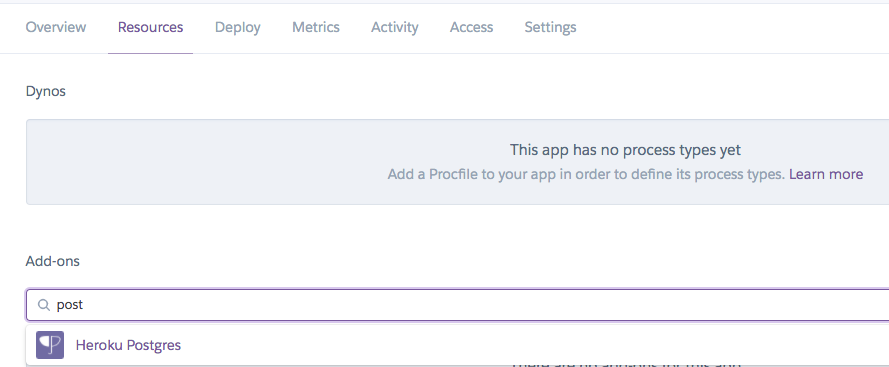
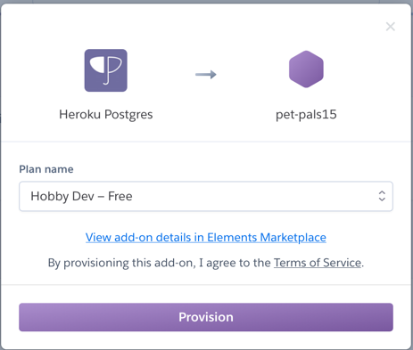
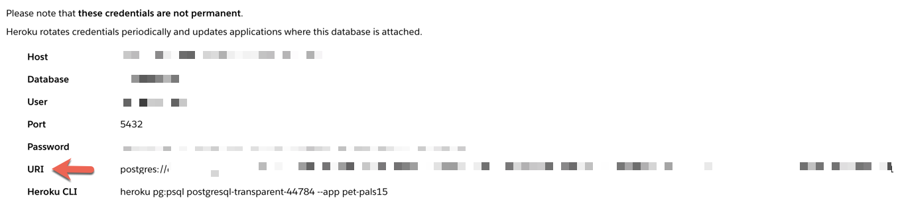

# petpals2
## Heroku Deployment

### Prerequisites

* Sign up for a [Heroku](https://www.heroku.com) account.

### Deploying an application

* In this activity, we will deploy a Pet Pals application to Heroku. The applications takes the name, latitude, and longitude of a pet and plot its location on a map. The actual code for the application is not nearly as important as the steps for deploying to Heroku. These steps can repeated for your own applications.
** **Note**: to simplify loading the data, this app is read only.  For a working example where new pets can be added, see the [fix_add](https://github.com/kourtbailey/petpals2/tree/fix_add) branch.


* This process consists of:

  1. Creating a repo for the application
  2. Preparing the repo with additional configuration files (`Procfile` and `requirements.txt`)
  3. Creating the Heroku application and provisioning a database
  4. Configuring the Heroku deployment

#### Part 1: Create a New Repo

* **Files:** [Pet Pals app](./Starter)

* On Github, create a new repo called **Pet_Pals**, *adding `env.sh` to your `.gitignore`* and clone it to your workstation.

* Add the starter files to this repo.

#### Part 2: Configuration Files

* Create a new conda environment for this app with the following code:
  * All of our project dependencies will be installed in this environment.
  * **Note:** This should contain only python 3.7&mdash;and not anaconda.

    ```sh
    conda create -n pet_pals_env python=3.7
    ```

* Activate this new environment before proceeding.

  ```sh
  conda activate pet_pals_env
  ```

  * **Note:** If you run into issues, try the following command instead.

    ```sh
    source activate pet_pals_env
    ```

* Next, we will use `requirements.txt`, which is a list of the Python packages required to run the app that we will use locally and o Heroku will use this file to install all of the app's dependencies.  Locally, install dependencies using `pip install -U -r requirements.txt`.

  * We have prepared a sample `requirements.txt` file for you.  Do not manually run `pip install package-name`: instead, add lines to `requirements.txt` and re-run `pip install -U -r requirements.txt`.
    * Gunicorn is a high-performance web server that can run your Flask app in a production environment
    * Because this app will be using Postgres, we will install `psycopg2` with `psycopg2-binary` (in a serious production environment, ask your seniors about the difference between psycopg2 and psycopg2-binary).
    * Flask: because this is a Flask app :)
    * Flask-SQLAlchemy: if you want to use SQLAlchemy

** There is a command `pip freeze` that will generate a list of the currently-installed dependencies, which should be the same as requirements.txt.  To uninstall everything and start fresh, run `pip freeze | xargs pip uninstall -y` or just delete and re-cretate the virtualenv.
** It is really important to make sure that all of your requirements are in `requirements.txt`

* Next, to set up your environment variables, run the following command _in bash_ (VSCode, git-bash, or MacOS terminal):
  ```sh
  source ./env.sh
  ```

** *Note 1*: Windows `cmd` and PowerShell use legacy MS-DOS syntax that is out of scope for the bootcamp
** *Note 2*: you will need to re-run this command (as well as re-activating your venv) when you close your terminal
** Within the file, we will set an environment variable, DATABASE_URL (on the server, Heroku will set this automatically...and change it periodically).


* You can test the application by running the following in your command line.
  ```sh
  flask run
  ```
  or
  ```sh
  gunicorn app.app:app
  ```
* Navigate to `127.0.0.1:5000` (or `127.0.0.1:8000`) to view your webpage and test out the app before deploying on Heroku.

* This starter code uses a `.sqlite` file as the database, but you can also use a CSV

* To see all the data in the database, navigate to the API, `http://127.0.0.1:5000/api/pals` or `http://127.0.0.1:8000/api/pals`.

* The final configuration file that we need is `Procfile`. This file is used by Heroku to run the app.  The first line,
  ```sh
  release: python -m etl.etl
  web: gunicorn app.app:app
  ```

  * In the code above, `app` is the name of the folder that contains your `app` as a python package (i.e., the name of the folder with the `__init__.py` file in it).
  * And etl.py is a Python script in your project's `etl` directory which will populate your database (note that it should be written so that it is _idempotent_: it will give the same result even if run a few times in succession.  In SQL, this would mean using be `DROP TABLE IF EXISTS table_name CASCADE;` before `CREATE TABLE` commands.

* Next, use git to `add`, `commit`, and `push` everything up to your repo.

#### Part 3: Creating the Heroku App

* Navigate to [Heroku](https://www.heroku.com) and log into your account.

* Once you are at the main dashboard, click **New** in the top right and select **Create a new app**.

  * Give your app an unique name, and leave the region as the default value.

* After creating a new app on Heroku, navigate to **Resources**:

  

* Under **Add-ons**, search `Heroku Postgres`. Make sure to use the free version, then click **Provision**.

  

* Once **Heroku Postgres** is added as your database, click on **Heroku Postgres**.

  

* Click on the **Settings** tab, then click on **View Credentials...**.

  

* The connection string to the database should now be available in the **URI** field:

  

* Heroku will automatically assign this URI string to the `DATABASE_URL` environment variable that is used within `app.py`. The code that is already in `app.py` will be able to use that environment variable to connect to the Heroku database (*NOTE* see the actual etl.py and app.py for modifications that need to be made to use SQLAlchemy > 1.4).

  ```python
  # DATABASE_URL will contain the database connection string:
  app.config['SQLALCHEMY_DATABASE_URI'] = os.environ.get('DATABASE_URL', '')
  # Connects to the database using the app config
  db = SQLAlchemy(app)
  ```


#### Part 4: Deploying the Heroku App
* On Heroku, go to the **Deploy** section of your app's homepage, and follow the steps to deploy the app.

  * In the **Deployment method** section, select **GitHub**, and your GitHub username should appear in the **Search for a repository to connect to** field. You can type “Pet_Pals” in the field that says **repo-name** or use the **Search** button to search for your pet-pals repo containing your code from the previous step.

    

  * Once the repo has been selected, click on **Connect**.

    

  * Once you see the "Your app was successfully deployed" message, you can click on **View** to launch your Pet Pals webpage.

    

    * **Note:** The database has not been set up yet, so there is one more step before it is fully functioning.

* Once your build is successful, you can open the application using **Open App** on the webpage.

* **Note:** When adding the pet's longitude, make sure you enter the negative value; otherwise, the data won't be populated on the US map.

* In `app.py`, we are mixing front-end and API code in the same file for simplicity.  Be sure to keep all of your API routes together and prefixed with `/api/` and all of your frontend routes together with no prefix.
